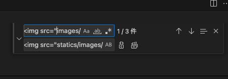

# PythonWEB演習2

## KujiraCafeの再構築

実際にKujiraCafeのデータをFlaskで再構築していきます。
*VSCodeで作業する前提です。

### KujiraCafeのデータを配置

`デスクトップ`に新しいディレクトリ(フォルダ)を作成します。ディレクトリ名は`kujira_cafe`とします。

`kujira_cafe`直下に`templates`と`statics`ディレクトリを作成。  
`templates`内に全ての`htmlファイル`を移動。  
`statics`ディレクトリ直下に`css`と`images`ディレクトリを移動します。

pythonファイル`app.py`を`kujira_cafe`直下に作成します。

現時点でのディレクトリとファイルの構成
```
├── kujira_cafe
│   ├── app.py
│   ├── statics
│   │   ├── css
│   │   │   └── style.css
│   │   └── images
│   │       ├── access-hero.jpg
│   │       ├── banner.jpg
│   │       ├── contact-hero.jpg
│   │       ├── gotop.svg
│   │       ├── home-hero.jpg
│   │       ├── item1.jpg
│   │       ├── item2.jpg
│   │       ├── item3.jpg
│   │       ├── item4.jpg
│   │       ├── item5.jpg
│   │       ├── item6.jpg
│   │       ├── item7.jpg
│   │       ├── item8.jpg
│   │       ├── item9.jpg
│   │       ├── logo-whale.svg
│   │       ├── logo.svg
│   │       ├── map.png
│   │       ├── menu-hero.jpg
│   │       └── stripe.png
│   └── templates
│       ├── access.html
│       ├── contact.html
│       ├── index.html
│       ├── menu.html
│       └── result.html
```

## Flask URLコントローラーと既存コンテンツを紐づける

### app.pyを編集する
`kujira_cafe`ディレクトリ直下のapp.pyを作成します。(すでに作成済みの場合は編集します。)

```python
from flask import Flask,render_template

app = Flask(__name__)

# TOPページへのルーティング

if __name__ == "__main__":
    app.run(host="0.0.0.0", port=8800, debug=True)
```
ルーティング設定が出来ていないのでページは表示されません。  
正常に動作していることを確認してください。

### ルーティングの設定
URLとプログラム動作の関係をルーティングと言います。  
リクエストされたURLと動作するメソッドを紐つけることでWebアプリケーションを管理します。この役割を**コントローラー**といいます。

URLと各ページの関係は下記の通りとします。

| URL | method | 関数名 | テンプレート |
| ---- | ---- |  ---- | ---- |
| / | GET | index | index.html |
| /menu | GET | menu | menu.html |
| /access | GET | access | access.html |
| /contact | GET | contact | contact.html |

### トップページのルーティングを設定する
app.pyを編集します。

```python
# TOPページへのルーティング
@app.route('/')
def index():
    return render_template('index.html')
```
トップページが表示されていることを確認します。  
CSSが適用されていません、また画像が表示されていません。

### 静的コンテンツを有効に
app.pyで`statics`ディレクトリを有効にします。
```python
from flask import Flask,render_template

app = Flask(__name__,static_folder='statics')
# 以下略
```


index.htmlのcssリンクを環境に合わせます。
```html
<title>KUZIRA CAFE</title>
<link rel="stylesheet" href="statics/css/style.css">
```
CSSが有効になったことをブラウザで確認します。

続いてindex.htmlの画像のパスを変更します。
```html
<div class="logo">
    <a href="index.html"></a>
</div>
```
画像が表示されていることを確認しましょう。  
確認出来たら、他の画像も更新してください。

変更場所が多いとコピペでミスが発生しやくなります。  
検索置換を使ってみましょう。  


***Review!!!***   
access/menu/contactページへのルーティングも追加して全ページを表示してみましょう。

### リンクを修正
TOPページにはページ内アンカーポイントへのリンクが設定されていますが正しく動作しなくなっています。

```html
<li><a href="index.html">ホーム</a></li>
<li><a href="index.html#news">お知らせ</a></li>
<li><a href="index.html#shop">店舗情報</a></li>
```

これはFlaskによりURLが`http://xxxx/index.html`から`http://xxx/`に変更されたためです。  
このルールに合わせてリンクを変更します。

```html
<li><a href="/">ホーム</a></li>
<li><a href="/#news">お知らせ</a></li>
<li><a href="/#shop">店舗情報</a></li>
```

同様に他のページへのリンクも変更されています。
```html
<li><a href="access.html">アクセス</a></li>
<li><a href="menu.html">メニュー</a></li>
<li><a href="contact.html">お問い合わせ</a></li>
```
これも適切に修正してリンクが動作することを確認しましょう。

### url_forを使ってリンクする
```html
<li><a href="/">ホーム</a></li>
```
これは`url_for関数`を用いて直接メソッドを呼び出すことも可能です。    
app.pyの`def index()`を呼び出しています。
```html
<li><a href="{{url_for('index')}}">ホーム</a></li>
```

***Review!!!***   
acess/menu/contactのページも全て修正してKujiraCafeが正しく動くようにしてみましょう。

[以降はPythonWeb3.mdに続く](PythonWeb3.md)