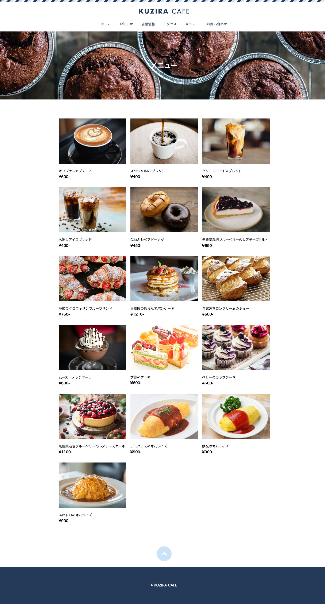

# PythonWEB演習3

## menuページを動的コンテンツ化
現在、静的に埋め込まれているコンテンツをCSVから読み取って動的に生成する

### データの準備
CSVファイルと画像をダウンロードします。  
[PythonWEB授業資料](https://github.com/ozaki-sozosha/PythonWEB/)

- `kujira_cafe/data/`から`menu.csv`
- `kujira_cafe/statics/images/`から`item10.jpg`から`item21.jpg`まで

をダウンロードします。

追加画像を`statics/images`ディレクトリに格納する。
`menu.csv`を`kujira_cafe`直下に`data`ディレクトリを作成し格納する。

dataディレクトリ、imagesディレクトリをダウンロードして差し替えてもOKです。

### Model作成
`kujira_cafe`直下に`models`フォルダを作成しPythonファイル`menu.py`を作成する。

現時点でのディレクトリとファイルの構成
```
 kujira_cafe
    ├── app.py
    ├── data
    │   └── menu.csv
    ├── models
    │   └── menu.py
    ├── statics
    │   ├── css
    │   │   └── style.css
    │   └── images
    │       ├── access-hero.jpg
    │       ├── banner.jpg
    │       ├── contact-hero.jpg
    │       ├── gotop.svg
    │       ├── home-hero.jpg
    │       ├── item1.jpg
    │       ├── item2.jpg
    │       ├── item3.jpg
    │       ├── item4.jpg
    │       ├── item5.jpg
    │       ├── item6.jpg
    │       ├── item7.jpg
    │       ├── item8.jpg
    │       ├── item9.jpg
    │       ├── item10.jpg
    │       ├── item11.jpg
    │       ├── item12.jpg
    │       ├── item13.jpg
    │       ├── item14.jpg
    │       ├── item15.jpg
    │       ├── item21.jpg
    │       ├── logo-whale.svg
    │       ├── logo.svg
    │       ├── map.png
    │       ├── menu-hero.jpg
    │       └── stripe.png
    └── templates
        ├── access.html
        ├── base.html
        ├── contact.html
        ├── index.html
        ├── menu.html
        └── result.html
```

## CSVデータの取得とWebコンテンツの動的生成
### CSVデータを取得しよう
models/menu.pyを編集する
```
import csv,os

class Menu:
    # クラス変数：対象ファイル(フルパスで対応)
    file = os.getcwd()+"/data/menu.csv"
    # コンストラクタ
    def __init__(self):
        self.menus = [] #menuを格納するリスト
    
    # CSVを読み出す
    def load_csv(self):
        #csvを読み出す
        with open(Menu.file, 'r', encoding='utf-8') as f:
            data = list(csv.reader(f))
            self.menus.extend(data)
    
    # メニューを取り出す
    def get_menu(self):
        return self.menus
        
if __name__ == "__main__":
    m = Menu()
    m.load_csv()
    print(m.get_menu())
```
動作確認を行う。  
ターミナルで`python3 models/menu.py`を実行  
メニューデータがリストで出力されていることを確認する

### Webコンテンツの動的生成
`app.py`を編集
```
## 略
import models.menu

## 略

@app.route('/menu')
def menu():
    # Menuクラスのインスタンス化
    menu = M.Menu()
    # CSVを読み出す
    menu.load_csv()
    # メニューデータの取り出し
    menus = menu.get_menu()
    # テンプレート(View)にデータを渡す
    return render_template('menu.html',menus=menus)
```
`templates/menu.html`を編集
```


メニュー

<h1 class="hero menu">メニュー</h1>


    <!-- メイン -->
    <main>
        <div class="items">
            
            <div class="item">
                
                <p>{{menu[0]}}<br><strong>¥{{menu[3]}}-</strong></p>
            </div>
            
        </div>
    </main>
    <!-- メインここまで -->

```
ブラウザで動作確認を行います。  
メニューのページで商品データが反映されていることを確認します。



[以降はPythonWeb4.mdに続く](PythonWeb4.md)

